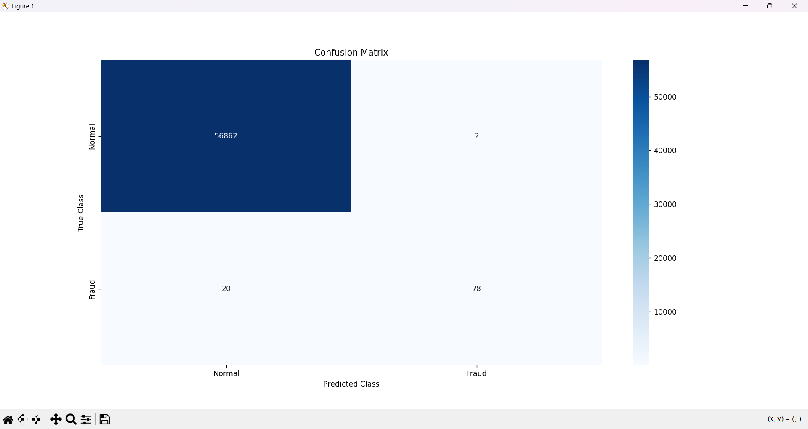

# 💳 Credit Card Fraud Detection with Machine Learning

## 📌 Project Overview
Fraudulent transactions represent a significant financial risk to institutions and customers. This project utilizes a **Random Forest Classifier** to identify fraudulent activity within a dataset of 284,000+ transactions. 

The primary challenge was managing extreme **class imbalance** (fraud accounts for only 0.17% of data). The model was optimized to balance high detection rates with a seamless customer experience.

## 📊 Key Results & Business Impact
Rather than relying on misleading accuracy scores, this model was evaluated using **Precision** and **Recall** to measure true business effectiveness.

* **Precision (97.47%):** High reliability in fraud alerts. Out of all predicted frauds, nearly 98% were correct, significantly reducing "False Alarms" and unnecessary card blocks for legitimate customers.
* **Recall (78.57%):** Successfully captured nearly 80% of all fraudulent transactions in the test set.
* **MCC (0.87):** A strong Matthews Correlation Coefficient confirms the model's robustness on imbalanced data.

### Confusion Matrix

*The matrix above illustrates the model's ability to separate normal transactions from fraudulent ones with minimal error.*

## 🛠️ Tech Stack
- **Language:** Python
- **Environment:** VS Code
- **Libraries:** - `Pandas` & `NumPy`: Data manipulation
  - `Scikit-Learn`: Machine Learning (Random Forest)
  - `Matplotlib` & `Seaborn`: Statistical visualization

## 📂 Dataset
The model was trained using the **Credit Card Fraud Detection** dataset provided by ULB on Kaggle.
> **Note:** Due to storage constraints, the CSV file is not hosted in this repository. 
> [Download the Dataset Here](https://www.kaggle.com/datasets/mlg-ulb/creditcardfraud)

---
*Created as part of a Business Analytics portfolio focusing on Risk Management and Predictive Modeling.*
